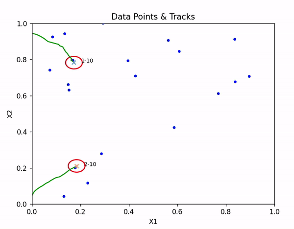
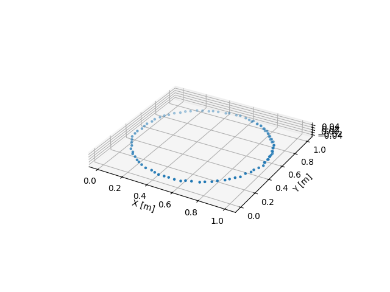
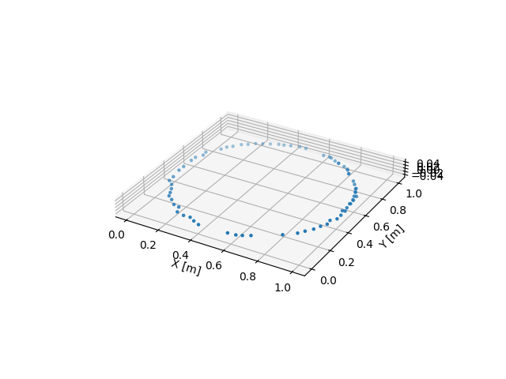
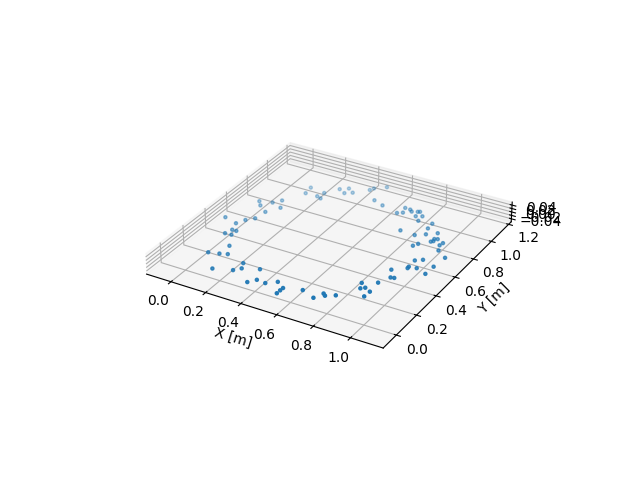
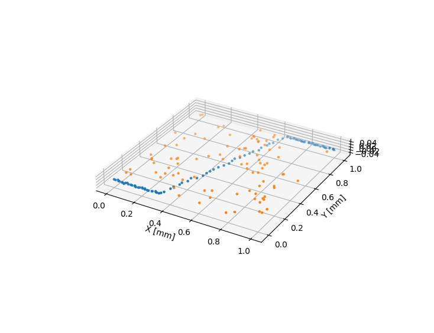
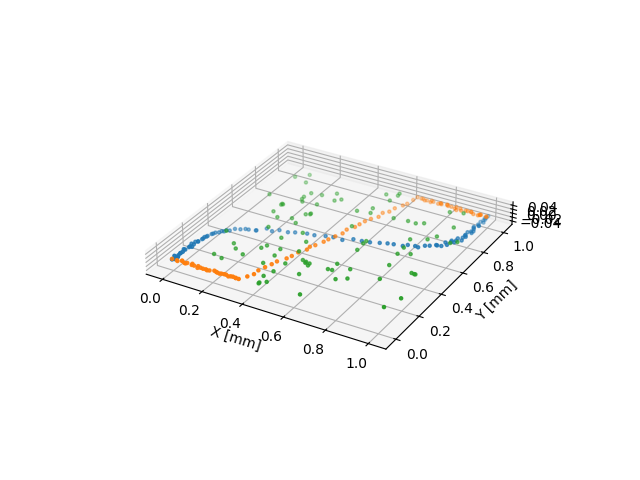
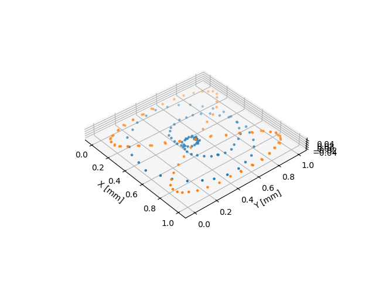

# PDAF Point Tracker

Multiple point tracker in 2D and 3D using Probability Density Approximation Filters (PDAF)

[]

# Description

Using PDAF Filters to predict, track and estimate position of multiple points.
It can deal with occlusion, tracking loss, intersection and different point motion profiles.

This code implements multiple target tracking in 2 and 3 dimensions using Numpy only. 
It is inspired by work of Y. Bar-Shalom related to Probabilistic Data Association Filters (PDAF).

Main file "pdaf_tracker.py" does the following:
1. Generates number of points moving on different trajectories.
2. Adds clutter and noisy points.
3. Initializes the tracking structures.
4. Implements multiple target tracking over the time.
5. The tracking supports multiple target initiation, occlusion and loss.
6. Uses Kalamn filter to track in time.

This code could be extended to multiple dimensions, target moving profiles and noise. 
The tracking algorithm tries to follow the original PDAF algorithm. 
However, some shortcuts are made. Several parameters control the behavior of the tracking.

You are invited to try and comment me on this code.

# Trajectories 

The motion of the points couild have differnt patterns and trajectroies.
The trajectory may have noise, missing data and clutter.
File "data_generator.py" contains function "init_scenario()" that allows to select the trajectories, noise and clutter as below.

Simple Trajectory   | Trajectories with Missing Data | Trajectories with Noise |
:------------: |  :----------: | :-------------:  |
  |   |   |

Trajectroies of points could vary , which in turn affects velocity and acceleration to be estimated

Trajectory with Clutter   | Multiple Trajectories | Complex Trajectories |
:------------: |  :----------: | :-------------:  |
  |   |   |

# Usage:

1. In python environment: 

   python pdaf_tracker.py

# Windows Install : 

1. In the PowerShell: 

   python.exe -m venv <your path>\envs\pdaf

2. Activate environment in Cmd: 

   <your path>\envs\pdaf\Scripts\activate.bat

3. Install packages :

    pip install numpy

4. Install packages (just for visualization):

    pip install matplotlib    

    

